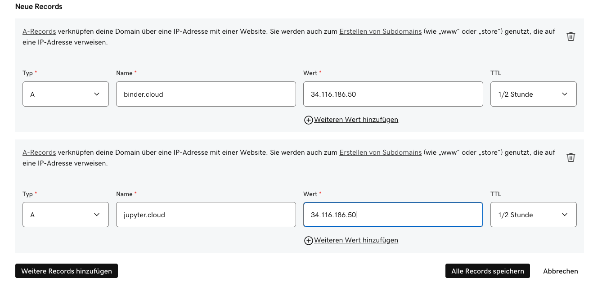

# Chapter 2: Deploy BinderHub

All commands in this chapter are run on the machine that has `kubectl` and `helm` access to the cluster:

| Setup | Where to run |
|-------|-------------|
| **Google Cloud (GKE)** | Google Cloud Shell |
| **Self-hosted (MicroK8s)** | The main node (control plane) via SSH or directly |

### Step 1: Add Helm Repository

```bash
helm repo add jupyterhub https://jupyterhub.github.io/helm-chart/
helm repo update
```

### Step 2: Clone Configuration Repository

Clone the deployment configuration:

```bash
git clone https://github.com/IntEL4CoRo/binder.intel4coro.de-deploy.git
cd binder.intel4coro.de-deploy
```

### Step 3: Configure Image Registry

The repository already includes a `secret.yaml`. Open it and fill in your Docker Hub credentials:

```yaml
registry:
  username: <your-dockerhub-username>
  password: <your-dockerhub-token>
```

> **Tip**: Alternatively, you can share the `intel4coro` Docker Hub account — all previously built VRB lab images are already available under that account and can be pulled directly without rebuilding. Contact us to obtain the login token.

> **Other registries**: To use a registry other than Docker Hub (e.g., GitHub Container Registry, Google Artifact Registry), refer to the official guide:
> [Set up the container registry](https://binderhub.readthedocs.io/en/latest/zero-to-binderhub/setup-registry.html#set-up-the-container-registry)

### Step 4: Review Configuration

The configuration file depends on your deployment target:

- **Self-hosted (MicroK8s)**: `binder.yaml`
- **Google Cloud (GKE)**: `binder-gke.yaml` — includes the same settings as `binder.yaml`, plus extra initialization steps in the user pod to install and configure **Vulkan** and **OpenGL** drivers (ICD loader, libGL, libEGL) so that GPU-accelerated rendering (Isaac Sim, VirtualGL, etc.) works on GKE's GPU nodes, which do not ship these libraries by default.

Before deploying, review the configuration file and update these values for your environment:

| Field | Description |
|-------|-------------|
| `jupyterhub.singleuser.memory` | Memory guarantee/limit for user pods |
| `jupyterhub.singleuser.cpu` | CPU guarantee/limit for user pods |
| `jupyterhub.singleuser.extraResource` | GPU resource requests |
| `jupyterhub.cull.every` | How often (in seconds) the culler checks for idle pods, `300` (5 min) |
| `jupyterhub.cull.timeout` | Shut down pods that have been idle for this many seconds, `1200` (20 min) |
| `jupyterhub.cull.maxAge` | Shut down pods that have been running for this many seconds, regardless of activity, `86400` (24 h) |
| `config.BinderHub.hub_url` | Public URL of the JupyterHub (e.g., `https://jupyter.intel4coro.de`) |

Adjust `maxAge` based on your expected session length — for example, a classroom workshop might use `14400` (4 hours), while a long-running research session may need `86400` (24 hours). On GKE with autoscaling node pools, shorter `maxAge` helps nodes scale down sooner and reduces costs.

> **How "idle" is determined**: The culler checks whether the user's JupyterLab or VS Code session has an active browser connection — **not** whether a program is running inside the pod. If the user closes the browser tab or loses network connectivity, the pod is considered idle even if a long-running task (e.g., model training, simulation) is still executing. Once the idle time exceeds `timeout`, the pod will be shut down and **all unsaved work and running processes are lost**. Users running long tasks must keep the page open in the browser for the entire duration.


#### Shared Storage (Self-Hosted Only)

The `binder.yaml` includes commented-out volume mounts under `jupyterhub.singleuser.storage`. These mount host directories into every user pod for shared large files and caches (HuggingFace models, pip packages, Isaac Sim cache, etc.):

```yaml
# jupyterhub.singleuser.storage.extraVolumeMounts / extraVolumes
# - huggingface-cache  →  /home/jovyan/.cache/huggingface
# - pip-cache          →  /home/jovyan/.cache/pip
# - isaacsim-cache     →  /mnt/isaacsim-cache
```

These use `hostPath` volumes pointing to directories on the node (e.g. `/srv/binder.intel4coro.de/cache/`), which only works in a self-hosted environment where you control the node filesystem. To enable them, uncomment the relevant blocks in `binder.yaml` and ensure the directories exist on the node with the correct permissions.

> **Google Cloud**: `hostPath` volumes are not suitable for GKE. To achieve equivalent shared storage, replace them with [Google Filestore](https://cloud.google.com/filestore) (NFS-backed `PersistentVolume`) or [GCS FUSE](https://cloud.google.com/storage/docs/gcsfuse-mount) mounts, and update the volume definitions accordingly.

### Step 5: Deploy BinderHub

The version pinned below (`1.0.0-0.dev.git.3506.hba24eb2a`) has been tested and confirmed stable for this setup. Newer versions are available but have not been verified.

**Google Cloud (GKE)** — use `binder-gke.yaml`:

```bash
helm upgrade --cleanup-on-fail \
  --install binder \
  jupyterhub/binderhub --version=1.0.0-0.dev.git.3941.h9056a226 \
  --namespace=binder \
  --create-namespace \
  -f ./secret.yaml \
  -f ./binder-gke.yaml
```

**Self-hosted (MicroK8s)** — use `binder.yaml`:

```bash
helm upgrade --cleanup-on-fail \
  --install binder \
  jupyterhub/binderhub --version=1.0.0-0.dev.git.3506.hba24eb2a \
  --namespace=binder \
  --create-namespace \
  -f ./secret.yaml \
  -f ./binder.yaml
```

To try a newer version, check https://hub.jupyter.org/helm-chart/#development-releases-binderhub and replace the `--version` value, then run `helm repo update` first.

### Step 6: Verify Deployment

Check that all pods are running:

```bash
kubectl get pods -n binder
```

Expected output:

```
NAME                              READY   STATUS    RESTARTS   AGE
binder-84865654fd-dmprl           1/1     Running   0          3m
hub-97bb86b88-rsx6w               1/1     Running   0          3m
proxy-55d986689c-ng8cz            1/1     Running   0          3m
user-scheduler-7b5bf99979-g26ff   1/1     Running   0          3m
user-scheduler-7b5bf99979-rw9ph   1/1     Running   0          3m
```

Check services:

```bash
kubectl get svc -n binder
```

Expected output:

```
NAME           TYPE           CLUSTER-IP       EXTERNAL-IP       PORT(S)        AGE
binder         LoadBalancer   10.152.183.224   192.168.1.200     80:30856/TCP   5m
hub            ClusterIP      10.152.183.127   <none>            8081/TCP       5m
proxy-api      ClusterIP      10.152.183.151   <none>            8001/TCP       5m
proxy-public   LoadBalancer   10.152.183.81    192.168.1.201     80:32656/TCP   5m
```

The two `LoadBalancer` services — `binder` and `proxy-public` — are the entry points for BinderHub and JupyterHub respectively.

- **Google Cloud (GKE)**: GKE automatically provisions cloud load balancers with **public IPs**. The `EXTERNAL-IP` values shown above will be publicly routable — you can access BinderHub directly at `http://<binder-external-ip>` right away, without any additional networking setup.
- **Self-hosted (MicroK8s)**: MetalLB assigns **local network IPs** (e.g., `192.168.1.x`). These are only reachable within the local network — a reverse proxy or tunnel is needed to expose them to the internet (see Step 6).

Update `config.BinderHub.hub_url` in `binder.yaml` to point to the `proxy-public` external IP:

```yaml
config:
  BinderHub:
    hub_url: http://<proxy-public-external-ip>
```

Then re-run the deploy command to apply the change:

```bash
helm upgrade binder --cleanup-on-fail \
  jupyterhub/binderhub --version=1.0.0-0.dev.git.3506.hba24eb2a \
  --namespace=binder \
  -f ./secret.yaml \
  -f ./binder-gke.yaml ## or binder.yaml
```

After this, the service is fully functional — open `http://<binder-external-ip>` to use BinderHub, which will redirect users to JupyterHub at the `proxy-public` IP for their sessions.

### Step 7: Configure Domain Names and HTTPS

This step is not required for the service to function — BinderHub is already reachable via the LoadBalancer IPs from Step 6. The purpose of this step is to make the service accessible via human-friendly domain names (and HTTPS) instead of raw IP addresses.

> **Two domain names required**: BinderHub consists of two publicly accessible services — the **BinderHub frontend** (handles repo building and launching) and the **JupyterHub proxy** (hosts the actual user sessions). Each needs its own domain name, e.g.:
> - `binder.your-domain.org` → BinderHub (`binder` service)
> - `jupyter.your-domain.org` → JupyterHub (`proxy-public` service)
>
> You can purchase a domain from any registrar (Namecheap, GoDaddy, Cloudflare Registrar, Google Domains, etc.), then create two subdomains (e.g. `binder` and `jupyter`).


#### Google Cloud (GKE)

Reference: [Secure with HTTPS](https://binderhub.readthedocs.io/en/latest/https.html).

1. Get a static IP(v4) address that you will assign to your ingress proxy later. For example:

    ```
    gcloud compute addresses create vrb-gpu --region europe-central2
    ```

    retrieve the assigned IP using:

    ```
    gcloud compute addresses list
    ```

    output:

    ```
    NAME: vrb-gpu
    ADDRESS/RANGE: 34.116.186.50
    TYPE: EXTERNAL
    PURPOSE: 
    NETWORK: 
    REGION: europe-central2
    SUBNET: 
    STATUS: RESERVED
    ```

1. Set A records to your above retrieved external IP, one for Binder and one for JupyterHub. Example of creating A records on Godaddy. Wait some minutes for the DNS A records to propagate.

    

1. To automatically generate TLS certificates and sign them using Let’s Encrypt, we utilise cert-manager.

    Install the latest version of [cert-manager](https://github.com/cert-manager/cert-manager):

    ```
    kubectl apply -f https://github.com/jetstack/cert-manager/releases/download/v1.20.1/cert-manager.yaml
    ```


1. We then need to create an issuer that will contact Let’s Encrypt for signing our certificates. Modify the file `binderhub-issuer.yaml` to replace the placeholder email with yours and instantiate it:

    ```
    kubectl apply -f binderhub-issuer.yaml
    ```

1. Ingress proxy using nginx

    We will use the nginx ingress controller to proxy the TLS connection to our BinderHub setup. Replace the placeholder `<STATIC-IP>` in file `nginx-ingress.yaml` to the static IP you get. Then run:

    ```
    helm repo add ingress-nginx https://kubernetes.github.io/ingress-nginx
    helm repo update                                          
    helm install binderhub-proxy ingress-nginx/ingress-nginx \
      --namespace binder \
      -f nginx-ingress.yaml
    ```

    Then wait until it is ready and showing the correct IP when looking at the output of:
    ```
    kubectl get svc -n binder
    ```

1. Uncomment all HTTPS configs blocks in `binder.yaml` and replace all the `cloud.intel4coro.de` with your domain, `cloud-intel4coro-de` accordingly, then apply the changes:

    ```bash
    helm upgrade binder --cleanup-on-fail \
      jupyterhub/binderhub --version=1.0.0-0.dev.git.3506.hba24eb2a \
      --namespace=binder \
      -f ./secret.yaml \
      -f ./binder-gke.yaml
    ```

    Once the command has been run, it may take up to 10 minutes until the certificates are issued.


#### Self-Hosted (MicroK8s)

The MetalLB load balancer assigns local network IPs to the `binder` and `proxy-public` services. These IPs are only reachable within the local network. Use [Cloudflare Tunnel](https://developers.cloudflare.com/cloudflare-one/connections/connect-networks/) to expose them publicly without opening firewall ports or requiring a public IP.

**Prerequisites**: A domain managed by Cloudflare (free plan is sufficient).

Follow the official guide to install `cloudflared`, authenticate, and create a tunnel:
[Create a locally-managed tunnel (CLI)](https://developers.cloudflare.com/cloudflare-one/connections/connect-networks/get-started/create-local-tunnel/)

Cloudflare handles HTTPS automatically — no certificate management required. Both domains will be accessible publicly once the tunnel is running.

Next, update `binder.yaml` with your domain names as described in the official BinderHub guide:
[Exposing JupyterHub and BinderHub](https://binderhub.readthedocs.io/en/latest/zero-to-binderhub/setup-binderhub.html#exposing-jupyterhub-and-binderhub)

Then apply the changes:

```bash
helm upgrade binder --cleanup-on-fail \
  jupyterhub/binderhub --version=1.0.0-0.dev.git.3506.hba24eb2a \
  --namespace=binder \
  -f ./secret.yaml \
  -f ./binder.yaml
```

### Step 8: Test the Complete Deployment

The BinderHub system is now fully deployed. Open your BinderHub domain in a browser:

```
https://binder.your-domain.org
```

To verify the full system is working end-to-end, launch the VRB lab test environment:

```
https://binder.your-domain.org/v2/gh/IntEL4CoRo/binder-template.git/main
```

This will trigger a full build-and-launch cycle — building the Docker image, pushing it to Docker Hub, and spawning a user session. If the JupyterLab interface loads successfully, the deployment is complete.

> **Google Cloud (GKE)**: If the node pool is configured with autoscaling and a minimum node count of `0`, the first lab launch may take several minutes while GKE provisions a new node to allocate compute resources. Subsequent launches will be faster as long as the node remains active.
>
> **Tip**: Before sessions with heavy expected usage (e.g., classroom, workshop, demo), warm up the node pool in advance by temporarily raising the minimum node count, so nodes are already provisioned when users start launching labs.

---

**Next**:
- **Google Cloud (GKE)**: Deployment is complete — Jump to [Chapter 4 — Troubleshooting](./04-troubleshooting.md) for day-to-day operations and common issues.
- **Self-hosted (MicroK8s)**: Continue to [Chapter 3 — GPU Time-Slicing](./03-gpu-time-slicing.md) to enable multiple users to share a single physical GPU.
