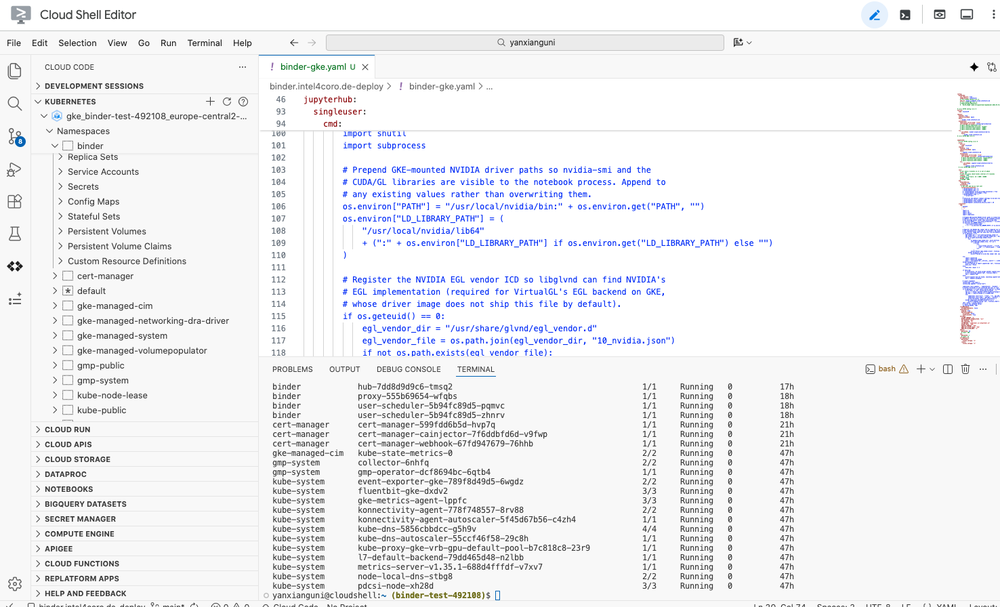

# Chapter 4: Troubleshooting

Common commands for monitoring and troubleshooting the BinderHub deployment.

## Google Cloud Shell Editor (GKE)

For GKE deployments, [Google Cloud Shell Editor](https://shell.cloud.google.com/) provides a browser-based VS Code environment with `kubectl`, `helm`, and `gcloud` pre-installed and pre-authenticated to your project. You can use it to run all the commands without any local setup — just open it from the Google Cloud Console (click the **Activate Cloud Shell** button in the top-right corner). The editor also includes a built-in terminal, file editor, and git support.

The left sidebar includes a **Cloud Code** panel with a GUI tool for Kubernetes cluster management. Expand the **Kubernetes** section to browse your GKE clusters, namespaces, workloads (Deployments, Pods, etc.), and services in a tree view. You can inspect pod status, view logs, open a shell into a running container, and manage resources — all without typing `kubectl` commands. This is especially useful for quickly checking pod health, reading logs during troubleshooting, and monitoring the `binder` namespace.



## Slow Pod Startup Due to GKE Autoscaling (GKE)

When a user launches a lab on GKE, the pod may take **5–15 minutes** to become ready — far longer than on a self-hosted setup where the node is always running. This is usually caused by the GKE cluster autoscaler provisioning a new node from scratch.

### Why it's slow

The delay is the sum of several sequential steps, each of which takes time:

| Step | Typical time | What's happening |
|------|-------------|-----------------|
| Node provisioning | 1–3 min | GKE creates a new VM and boots it |
| GPU driver installation | 2–5 min | NVIDIA drivers are installed on first boot (GKE auto-installs them via a DaemonSet) |
| Image pull | 2–10 min | The user pod image (e.g., Isaac Sim, ~15 GB) is pulled from Docker Hub to the new node |
| Pod startup | 10–30 s | Container starts, VirtualGL installs, JupyterLab launches |

On a **warm node** (already running, drivers installed, image cached), only the last step applies — launch is near-instant. The problem only occurs when the autoscaler scales from zero or adds a new node.

### Solutions

**1. Keep a minimum node count of 1** (simplest, costs money when idle)

Set the minimum node count to 1 so there is always a warm node ready:

```bash
gcloud container clusters update <cluster> \
  --node-pool=<gpu-pool> --location=<zone> \
  --enable-autoscaling --min-nodes=1 --max-nodes=<n>
```

**2. Pre-warm before scheduled sessions** (best for workshops/classes)

Before a class or demo, temporarily scale up the node pool so nodes are already provisioned when users arrive:

```bash
gcloud container clusters resize <cluster> \
  --node-pool=<gpu-pool> --location=<zone> --num-nodes=<n>
```

Scale back down afterwards to save costs. This can also be automated with a cron job or Cloud Scheduler.

**3. Pre-pull large images** (reduces image pull time on new nodes)

Use a DaemonSet to pre-pull frequently used images onto every node as soon as it joins the cluster:

```yaml
apiVersion: apps/v1
kind: DaemonSet
metadata:
  name: image-prepuller
  namespace: binder
spec:
  selector:
    matchLabels:
      app: image-prepuller
  template:
    metadata:
      labels:
        app: image-prepuller
    spec:
      initContainers:
        - name: pull-image
          image: <your-most-used-image>
          command: ["sh", "-c", "exit 0"]
      containers:
        - name: pause
          image: registry.k8s.io/pause:3.9
```

This doesn't prevent node provisioning delay, but eliminates the image pull wait (~2–10 min) once the node is up.

## Kubernetes Dashboard (self-hosted)

The Kubernetes dashboard provides a web UI to inspect pods, logs, and cluster resources.

**1. Get the dashboard address:**

```bash
microk8s kubectl get svc -n kube-system kubernetes-dashboard
```

The dashboard runs as a `ClusterIP` service. To access it from your browser, use kubectl port-forward:

```bash
microk8s kubectl port-forward -n kube-system svc/kubernetes-dashboard 10443:443
```

Then open `https://localhost:10443` in your browser. If the dashboard is exposed via a reverse proxy or Cloudflare Tunnel, use that URL instead.

**2. Generate a login token** (valid for 2000 hours):

```bash
kubectl create token default --duration=2000h
```

Paste the token into the dashboard login page to authenticate.

## Command lines

**Watch pod status:**

```bash
# All namespaces
watch "microk8s.kubectl get pods -A"

# Binder namespace only
watch "microk8s.kubectl get pods -n binder"
```

**Pod logs and details:**

```bash
kubectl logs -n binder <pod-name> -f
kubectl describe pod -n binder <pod-name>
```

## Common Operations

**Manage resource quota** — by default there are no resource limits on the `binder` namespace. `resource-quota.yaml` can be applied to cap the total number of concurrent pods, CPU, or memory across all user sessions. If the current load exceeds the configured limit, new user pods will not be scheduled until resources are freed.

Edit `resource-quota.yaml` to set the limits you need, then apply:

```bash
kubectl apply -f ./resource-quota.yaml -n binder
```

To check current usage against the quota:

```bash
kubectl get resourcequota -n binder
```

To remove the quota entirely:

```bash
kubectl delete resourcequota binderhub -n binder
```

**Delete all user pods** (prefix `jupyter-`):

```bash
kubectl get pods -n binder --no-headers=true | awk '/jupyter-/{print $1}' | xargs kubectl delete pod -n binder
```

**Manage container images** (MicroK8s uses its own containerd, separate from Docker):

```bash
# List all images
microk8s ctr images ls

# List images matching a pattern
microk8s.ctr images ls | grep intel4coro

# Delete images matching a pattern
microk8s.ctr images rm $(microk8s.ctr images list | grep <pattern> | awk '{print $1}')
```

**Update BinderHub configuration** — after editing `binder.yaml`:

```bash
microk8s.helm upgrade binder --cleanup-on-fail \
  jupyterhub/binderhub --version=1.0.0-0.dev.git.3506.hba24eb2a \
  --namespace=binder \
  -f ./secret.yaml \
  -f ./binder.yaml
```

**Upgrade BinderHub version:**

1. Check the latest version at https://hub.jupyter.org/helm-chart/#development-releases-binderhub
2. Run `helm repo update`
3. Replace the `--version` value in the deploy command and re-run it

## Troubleshooting

### Firewall Issues After Reboot

Symptoms: pods cannot communicate, services unreachable.

```bash
sudo ufw disable
sudo ufw allow in on cni0
sudo ufw allow out on cni0
sudo ufw default allow routed
sudo ufw enable
```

### Pods Stuck in Pending State

```bash
kubectl describe pod -n binder <pod-name>
kubectl get resourcequota -n binder
```

Common causes:
- Insufficient CPU/memory/GPU resources
- Resource quota exceeded
- Build node selector mismatch

### GPU Not Available in Pods

```bash
# Verify GPU operator pods are running
kubectl get pods -n gpu-operator-resources

# Check node GPU resources
kubectl describe node <node-name> | grep nvidia

# Restart GPU device plugin if needed
kubectl -n gpu-operator-resources rollout restart daemonset nvidia-device-plugin-daemonset
```

### Binder Pods Fail to Restart After Reboot

Ensure MicroK8s is ready first:

```bash
microk8s status --wait-ready
```

If pods are stuck, a Helm upgrade can recover them:

```bash
microk8s.helm upgrade binder --cleanup-on-fail \
  jupyterhub/binderhub --version=1.0.0-0.dev.git.3506.hba24eb2a \
  --namespace=binder \
  -f ./secret.yaml \
  -f ./binder.yaml
```
