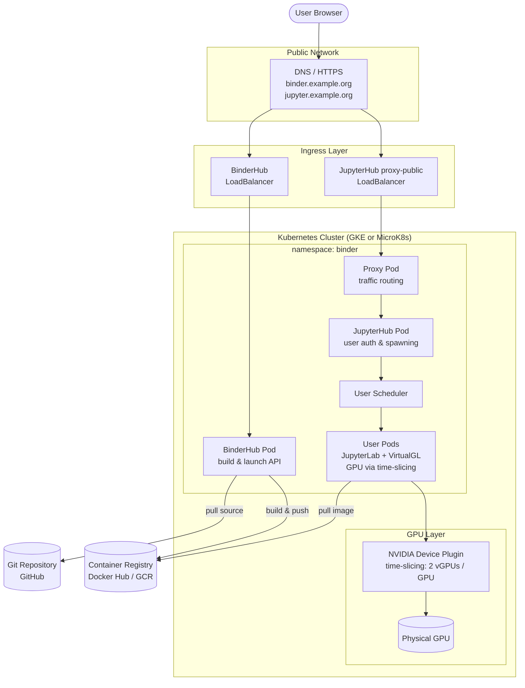

# VRB Binderhub Server Deployment Guide with GPU Resources

Complete guide for deploying the [Virtual Research Building (VRB)](https://vrb.ease-crc.org/) server — a cloud-based robotics platform built on the [BinderHub](https://github.com/jupyterhub/binderhub) project, with NVIDIA GPU support. BinderHub enables users to launch reproducible computing environments from Git repositories; this deployment extends it with GPU time-slicing and VirtualGL for GPU-accelerated rendering in user pods (Isaac Sim, OpenGL/Vulkan applications, etc.).

This guide covers **two deployment targets**, and each chapter walks through both in parallel:

| Target | Cluster | GPU sharing | Public access |
|--------|---------|-------------|---------------|
| **Google Cloud** | GKE managed cluster with GPU node pools | GKE-native time-slicing (set at node-pool creation via `gcloud` flags) | GKE Load Balancer + nginx ingress + cert-manager (Let's Encrypt) |
| **Self-hosted** | MicroK8s on your own Ubuntu machine | NVIDIA gpu-operator + `time-slicing-config-all.yaml` | Cloudflare Tunnel |

Pick whichever fits your situation — the chapters mark which steps apply to which target.

## Architecture Overview

## Table of Contents

| Chapter | Description |
|---------|-------------|
| [1. Kubernetes Cluster Setup](./01-kubernetes-setup.md) | Set up the Kubernetes cluster (self-hosted MicroK8s or Google Cloud GKE) |
| [2. Deploy BinderHub](./02-deploy-binderhub.md) | Prepare host filesystem, deploy BinderHub via Helm, expose to public network |
| [3. GPU Time-Slicing](./03-gpu-time-slicing.md) | Configure NVIDIA GPU time-slicing for multi-pod GPU sharing |
| [4. Troubleshooting](./04-troubleshooting.md) | troubleshooting, Day-to-day operations |
| [5. Shutdown and Uninstall](./05-shutdown-uninstall.md) | Tear down services and clean up resources |

## References:

- https://binderhub.readthedocs.io/en/latest/zero-to-binderhub/
- https://z2jh.jupyter.org/en/stable/index.html